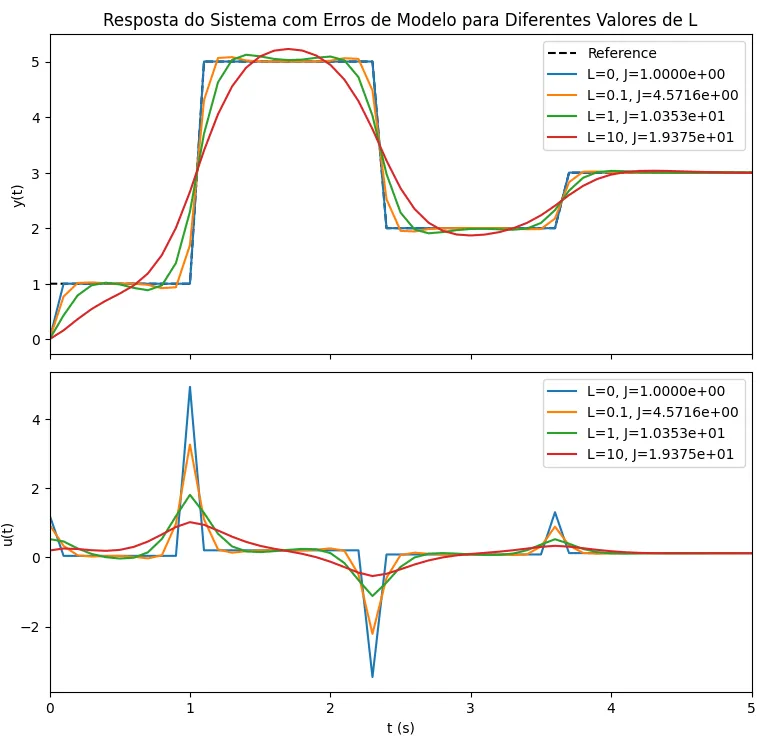
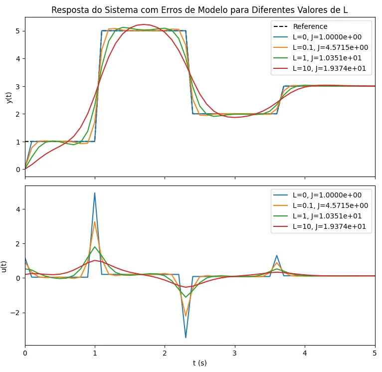
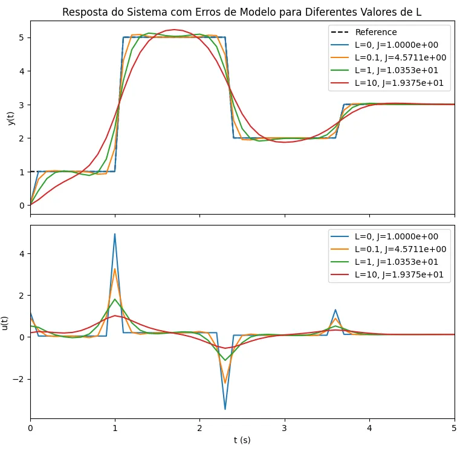

### Controle preditivo

#### Adição de erro ao modelo

Durante a simulação do sistema, é inserido um ruído gaussiano de pequena magnitude para representar incertezas de modelo:

```python
y[k] += 0.2e-10 * np.random.randn()
```	

#### Otimizador Local
Utiliza o método BFGS da função minimize do SciPy para realizar uma descida de gradiente local:

```python
res = minimize(f, x0, method='BFGS', tol=1e-10)
```
<p align="center">
  
</p>

#### Otimizador Global - basinhopping
Aplica uma estratégia global que combina descida local com saltos aleatórios:
  
```python
minimizer_kwargs = {"method": "BFGS", "options": {"disp": False, "gtol": 1e-10}}
res = basinhopping(f, x0, minimizer_kwargs=minimizer_kwargs, niter=10)
```
<p align="center">
  
</p>

#### Otimização Híbrida (Global + Local)
Combina basinhopping para busca global com um refinamento local adicional, desde que este último melhore o custo:

```python
res_global = basinhopping(f, x0, minimizer_kwargs=minimizer_kwargs, niter=10)

res_local = minimize(f, res_global.x, method='BFGS', options={'gtol': 1e-10, 'disp': False})

if res_local.fun < res_global.fun:
    du = res_local.x[0]
else:
    du = res_global.x[0]
```

<p align="center">
  
</p>


