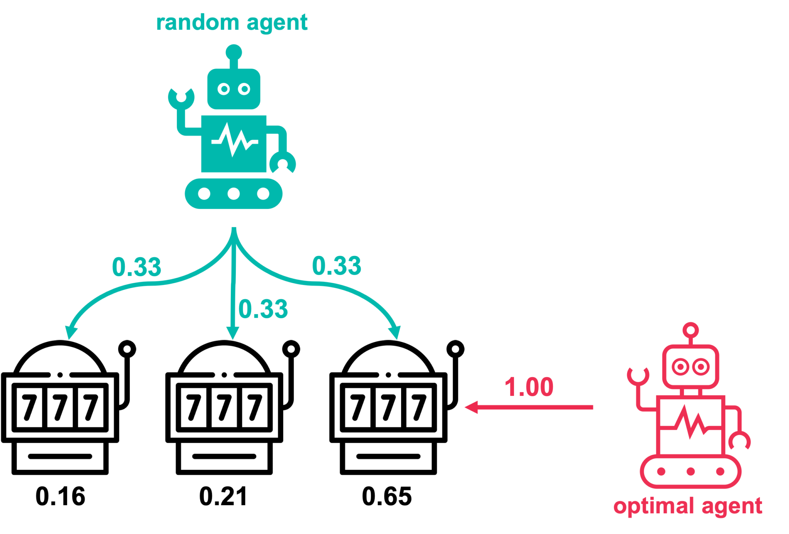
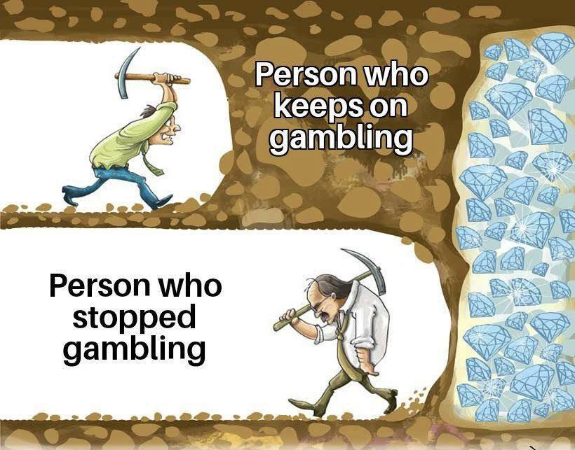

### Exploitation vs Exploration

Embora os dois termos tenham a mesma tradução em PT-BR , eles têm significados distintos e são aplicados em diferentes contextos.
Usando uma analogia, podemos pensar em um padeiro que está se formando e tem um sonho de abrir uma padaria. Ele tem duas opções: produzir pães e doces que já conhece ou experimentar novas receitas. 

- Exploration: Na nossa analogia, o padeiro decide experimentar novas receitas. Ele pode fazer isso de várias maneiras, como testar novos ingredientes, receitas do Masterchef™️ ou até mesmo criar doces novos. Essa fase é importante para descobrir novas oportunidades, mas pode levar a resultados incertos e desastres culinários.

- Exploitation: O padeiro decide se concentrar em suas receitas que já domina, como por exemplo o Bolo de Cenoura. Ele pode fazer isso de várias maneiras, como comprar cenouras de melhor qualidade, instalar equipamentos novos e melhorar eficiência do processo. Essa fase é importante para maximizar os resultados, mas pode levar a uma falta de inovação e estagnação.

O grande desafio está em equilibrar essas duas abordagens. Se o padeiro focar apenas na Exploration, pode desperdiçar tempo e recursos em experiências que não dão retorno. Por outro lado, se optar somente pela Exploitation, corre o risco de nunca encontrar as melhores oportunidades que poderiam levar seu negócio a outro nível. Esse é o trade-off entre Exploration e Exploitation.

### Aplicação Real
Na prática, podemos citar o K-armed Bandit Problem, que é um problema clássico em aprendizado por reforço. O problema consiste em um jogador que tem que escolher entre K máquinas caça-níqueis (bandits) com diferentes probabilidades de ganhar. O jogador deve decidir entre Exploration novas máquinas ou Exploitation as que já conhece e que têm uma alta taxa de retorno.

Para fazer isso, o jogador pode usar diferentes estratégias, como:
- Random Agent: O jogador escolhe aleatoriamente uma máquina para jogar. Essa estratégia é simples, mas pode levar a resultados inesperados ( como já diz no nome).
- Optimal Agent: O jogador escolhe a máquina com a maior taxa de retorno esperada. Essa estratégia é mais eficiente, mas se já sabemos qual é a melhor máquina não tem mais razão para Exploration.

<p align="center">
  
</p>
<p align="center">
  <a href="https://towardsdatascience.com/solving-multi-armed-bandit-problems-53c73940244a/">Fonte da imagem</a>
</p>

- Epsilon Agent: O jogador escolhe aleatoriamente uma máquina com uma probabilidade de epsilon (Exploration). Por exemplo, se epsilon for 0.1, o jogador escolherá aleatoriamente uma máquina 10% do tempo e escolherá a melhor máquina 90% do tempo (Exploitation). Essa estratégia tenta equilibrar o trade-off entre Exploration e Exploitation.

Em termo de código, podemos exemplificar com um pseudo-código:
```python
# Estratégia 1: Random Agent
def random_agent():
    escolha = escolher_aleatoriamente_entre(0, k-1)
    atualizar_estimativa(escolha)

# Estratégia 2: Optimal Agent (assume que já conhecemos a melhor máquina)
def optimal_agent():
    atualizar_estimativa(melhor_maquina)

# Estratégia 3: Epsilon Agent
def epsilon_agent(epsilon):
    if numero_aleatorio() < epsilon:
        # Exploração: escolher uma máquina aleatória
        escolha = escolher_aleatoriamente_entre(0, k-1)
    else:
        # Exploração: escolher a máquina com maior estimativa
        escolha = argmax(estimativas)
    atualizar_estimativa(escolha)


```

### Conclusão
Existem diveras outras estratégias para lidar com o trade-off entre Exploration e Exploitation, como UCB (Upper Confidence Bound) e Thompson Sampling. Cada uma delas tem suas vantagens e desvantagens, e a escolha da estratégia depende do contexto e dos objetivos do problema.

Encontrar o equilíbrio certo entre Exploration e Exploitation pode levar a melhores resultados e maior eficiência. Assim como o padeiro, devemos estar abertos a novas experiências, mas também focar em maximizar o que já sabemos fazer bem.

<p align="center">
  
</p>