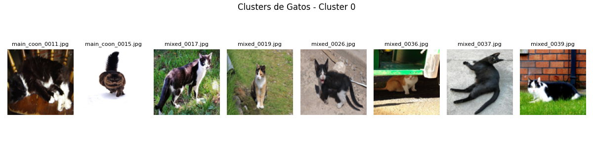
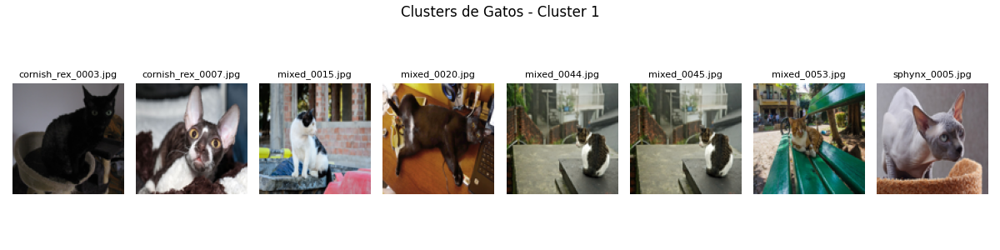
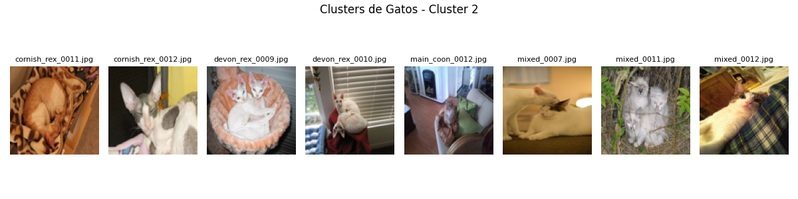
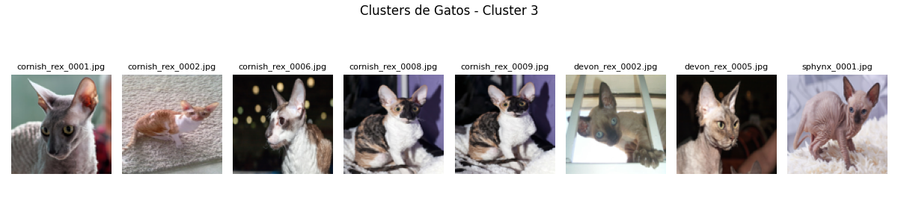
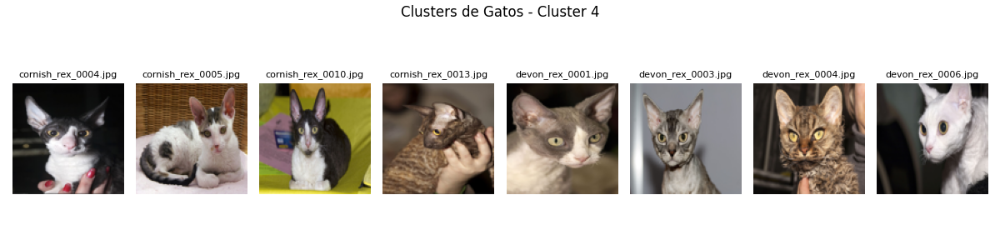
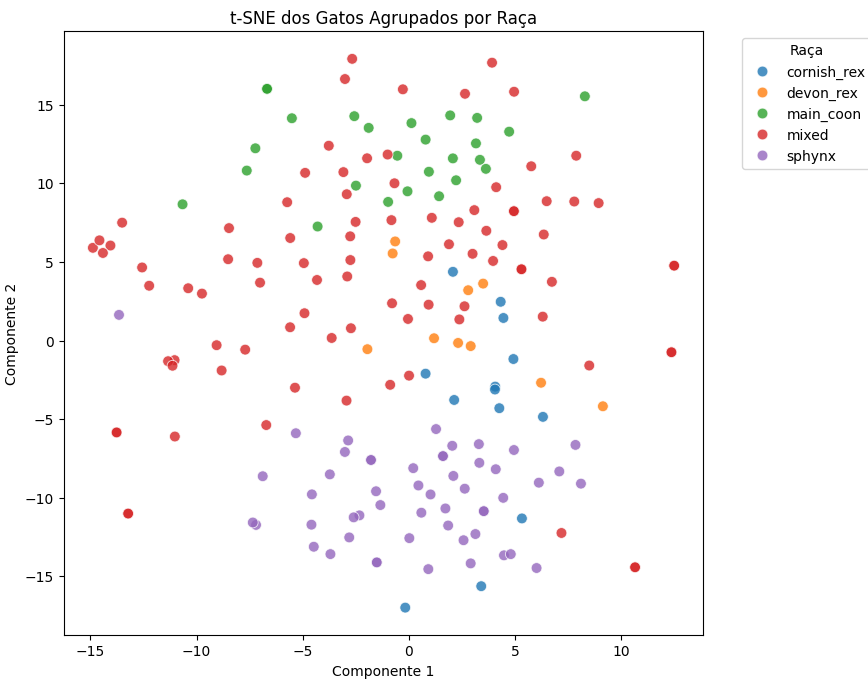
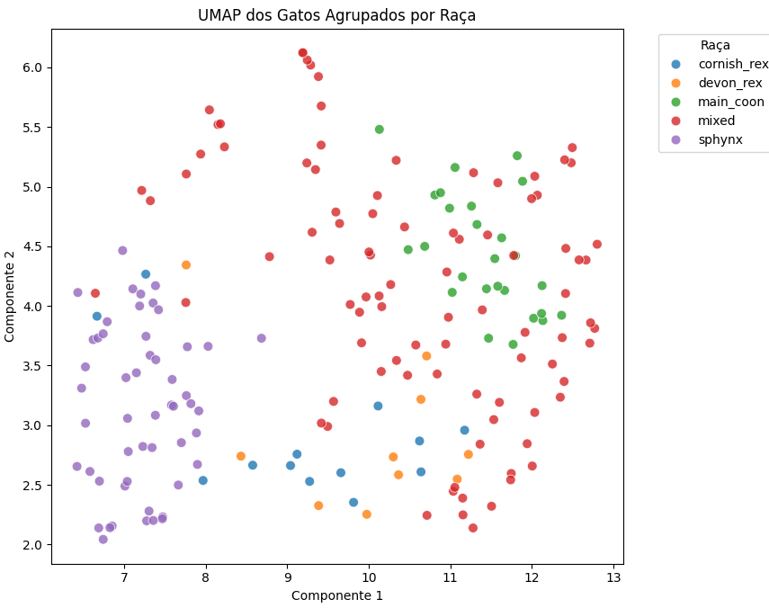
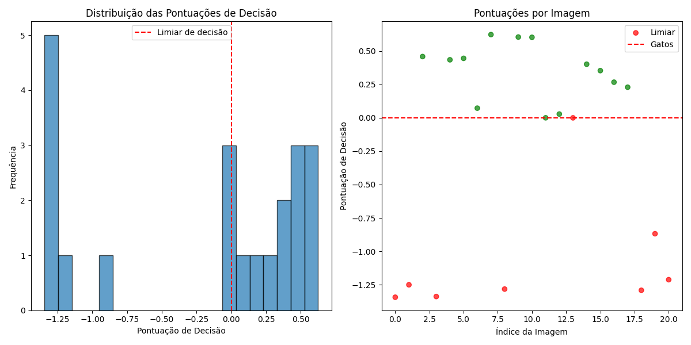
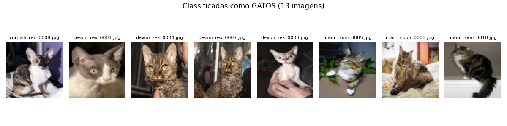
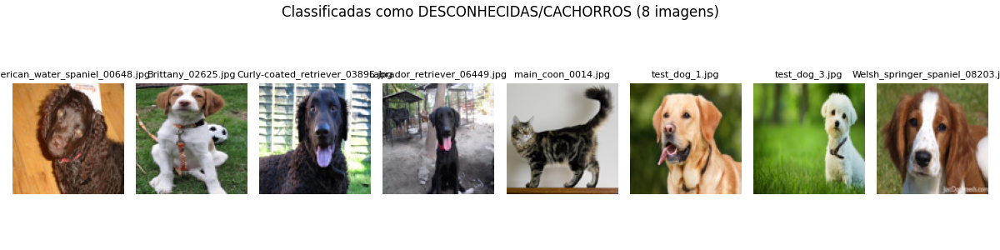

# Classificador de Raças de Gatos

Este projeto utiliza **aprendizado não supervisionado** para agrupar e visualizar raças de gatos a partir de imagens, além de aplicar One-Class para identificar imagens fora do padrão (outras espécies, como cachorros).

As técnicas de redução de dimensionalidade **t-SNE** e **UMAP** são utilizadas para analisar visualmente a separação entre as raças.

## Estrutura do Projeto

O pipeline funciona da seguinte forma:

1. Carregamento de imagens de gatos ( nomeadas por raça na pasta imagem).
2. Extração de embeddings usando **ResNet50**.
3. Redução de dimensionalidade (t-SNE e UMAP).
4. Clusterização com **KMeans**.
5. Detecção de classes indefinidas com **One-Class SVM**.
6. Visualização dos resultados.

## Raças Consideradas

O dataset utilizado contém imagens de gatos das seguintes raças:

- `cornish_rex`
- `devon_rex`
- `main_coon`
- `mixed`
- `sphynx`

## Visualização dos Clusters

As imagens foram agrupadas automaticamente com KMeans em 5 clusters (k=5), pois temos 5 raças diferentes no dataset. Abaixo, algumas imagens de exemplo por cluster:



 

 

 

 


## Redução de Dimensionalidade

Para visualizar os agrupamentos e possíveis separações entre raças, foram utilizadas as técnicas de:

### t-SNE



### UMAP



> Cada ponto representa uma imagem de gato, colorida de acordo com sua raça (extraída do nome do arquivo).

## Detecção de Classes Indefinidas

Um classificador **One-Class** foi treinado usando apenas as imagens de gatos.

Em seguida, imagens desconhecidas (incluindo **cachorros**) foram avaliadas. O modelo detecta "outliers" com base na distância dos embeddings em relação ao padrão aprendido.

### Limite de Decisão do Classificador



### Resultados da Detecção





```bash
Imagens classificadas como GATOS: 13
Imagens classificadas como DESCONHECIDAS/CACHORROS: 8

 GATOS
devon_rex_0008.jpg: 0.623 (GATO)
main_coon_0005.jpg: 0.605 (GATO)
main_coon_0008.jpg: 0.603 (GATO)
cornish_rex_0008.jpg: 0.459 (GATO)
devon_rex_0004.jpg: 0.445 (GATO)

 DESCONHECIDAS
Brittany_02625.jpg: -1.251 (DESCONHECIDA)
Labrador_retriever_06449.jpg: -1.283 (DESCONHECIDA)
test_dog_1.jpg: -1.292 (DESCONHECIDA)
Curly-coated_retriever_03896.jpg: -1.339 (DESCONHECIDA)
American_water_spaniel_00648.jpg: -1.344 (DESCONHECIDA)
```

## Como Rodar

```bash
source venv/bin/activate #para Linux/Mac 
 ./venv/Scripts/activate # para Windows
pip install -r requirements.txt
python main.py
