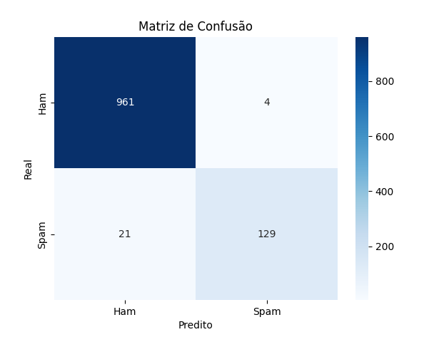

# Classificador de Mensagens SPAM ou HAM

Este projeto utiliza aprendizado de máquina para classificar mensagens de texto (SMS) como **SPAM** ou **HAM** (não-spam), com base no dataset tirado do [Kaggle](https://www.kaggle.com/datasets/uciml/sms-spam-collection-dataset?resource=download) .

## Sobre o Dataset

O dataset é composto por mensagens reais rotuladas manualmente como:
- **`ham` (0)**: mensagem legítima
- **`spam` (1)**: mensagem indesejada

> O dataset foi carregado usando o `pandas`, e os textos foram renomeados para `text` e os rótulos para `label`.

##  Modelo Escolhido

O modelo usado foi o **RandomForestClassifier**, por ser fácil a implementação e ser adequado para trabalhar com high dimensional dados em classificação de texto, conforme o [artigo](https://dl.acm.org/doi/10.1145/3357384.3357891)

##  Separação dos Dados

Os dados foram separados em:
- **80% para treino**
- **20% para teste**

A função `train_test_split` foi usada com `random_state=42` para garantir reprodutibilidade.

## Vetorização das Mensagens

Como os modelos não entendem texto diretamente, foi necessário transformar as mensagens em vetores numéricos usando o **TF-IDF** (`TfidfVectorizer`).

##  Métricas de Avaliação

Foram usadas três métricas principais:

- **Precisão (Precision)**: mede a proporção de mensagens classificadas como spam que realmente eram spam.
- **Acurácia (Accuracy)**: porcentagem geral de classificações corretas.
- **G-Mean**: média geométrica entre sensibilidade (recall para SPAM) e especificidade (recall para HAM).

## Escolha dos Hiperparâmetros

Os hiperparâmetros do modelo foram definidos com base nos melhores resultados encontrados através de um grid search implementado no arquivo `best.py`. Neste script, diferentes combinações de parâmetros foram testadas e avaliadas para identificar a configuração que proporciona o melhor equilíbrio entre precisão, acurácia e gmean.

A escolha para o modelo foi:

```python
model = RandomForestClassifier(
    random_state=42,
    n_estimators=100,
    max_depth=None,
    min_samples_split=20,
    n_jobs=-1
)
```

### Resultados Obtidos

```
Precisão (Precision): 0.9632
Acurácia (Accuracy): 0.9784
G-Mean: 0.9320
```

### Distribuição das Classes  


### Matriz de Confusão  


### Top 20 Palavras mais Relevantes nas Mensagens SPAM  


### Top 20 Palavras mais Relevantes nas Mensagens HAM  


##  Previsão com Novas Mensagens

O modelo também foi testado com mensagens simuladas. Veja abaixo os resultados:

```
[SPAM] free entry into our contest! text win to 80085 now!
[SPAM] you’ve been selected for a $500 walmart gift card. click to claim.
[HAM] congratulations! you've won a free ticket to the bahamas. call now!
[SPAM] urgent! you have won a 1,000,000 prize. reply yes to claim.
[HAM] win a brand new car! click the link below now!!!
[HAM] you are chosen for an exclusive deal. limited time only!
[HAM] earn money from home with this simple trick. limited slots!
[SPAM] claim your free trial now. no credit card required!
[HAM] act now! this offer expires in 12 hours!
[HAM] you've been selected for a financial grant of $2000. click to apply!

[HAM] hey, can you pick me up after work today?
[HAM] don't forget to bring your notebook to class.
[HAM] are we still meeting for lunch today?
[HAM] i'll be late, caught in traffic.
[HAM] hey, i’ll call you back after the meeting.
[HAM] sure, see you at 6!
[HAM] thanks for the update. i'll check it out.
[HAM] do you need help with your homework?
[HAM] let's grab coffee tomorrow at 10.
[HAM] that sounds good. talk later!

```
## Conclusão

As métricas de avaliação mostram que o modelo alcançou uma **precisão de 96.32%** e uma **acurácia de 97.78%** na classificação de mensagens como spam ou ham. Embora esses resultados pareçam bons, o desempenho pode estar utópico demais, sugerindo que o modelo pode não estar generalizando tão bem quanto aparenta.

Por fim, a análise das palavras mais importantes para cada classe (spam e ham) mostrou que o modelo consegue identificar padrões relevantes de palavras associadas a cada tipo de mensagem. Palavras como “free”, “txt”, “mobile”, “claim” aparecem como fortes indicativos de spam, enquanto palavras como “ok”, “just”, “come” e “like” são mais comuns em mensagens ham.
